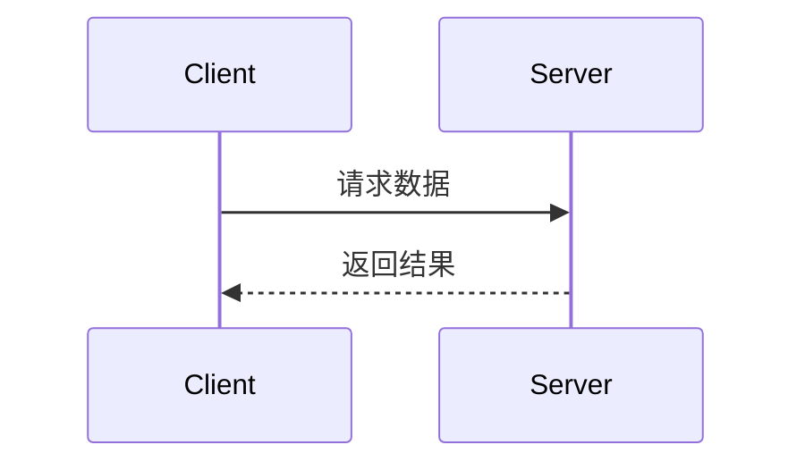

# API 文档模板

## 简短描述接口功能名称

**功能描述：** 详细描述接口的业务用途  
**接口地址：** /api/endpoint  
**请求方式：** GET/POST

### 功能说明

详细描述接口的业务逻辑，接口内部做了什么，调用哪些类，操作了哪些表。可以使用流程图或时序图：



### 请求参数

```json
{
  "page": 1,
  "page_size": 10,
  "status": "active"
}
```

| 参数名 | 类型 | 必填 | 说明 | 示例值 |
|---|---|---|---|---|
| page | int | 否 | 页码（默认 1） | 2 |
| page_size | int | 否 | 每页数量（默认 10） | 20 |
| status | string | 否 | 状态过滤 | active |

### 响应参数

```json
{
  "code": 0,
  "message": "获取用户基本信息成功",
  "data": {
    "user_id": 1,
    "username": "admin",
    "email": "admin@example.com",
    "status": "active"
  }
}
```

| 参数名 | 类型 | 必填 | 说明 | 示例值 |
|---|---|---|---|---|
| code | int | 是 | 响应码 | 0 |
| message | string | 是 | 响应消息 | 获取用户基本信息成功 |
| data | object | 是 | 响应数据 | |
| data.user_id | int | 是 | 用户 ID | 1 |
| data.username | string | 是 | 用户名 | admin |
| data.email | string | 是 | 邮箱 | admin@example.com |
| data.status | string | 是 | 用户状态 | active |

## 文档同步规则

以下任一变更发生时，必须同步更新 API 文档：

- 入参结构变更
- 返回参数变更
- URL 地址变更
- 请求方式变更
